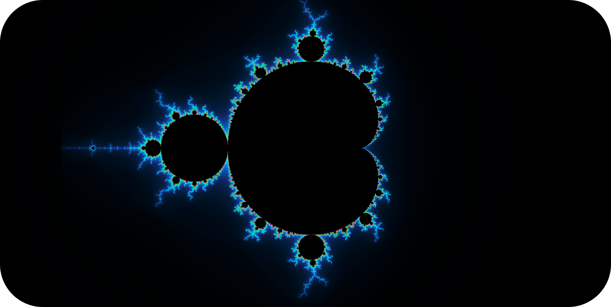
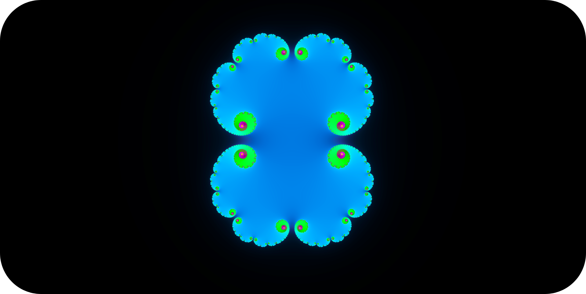
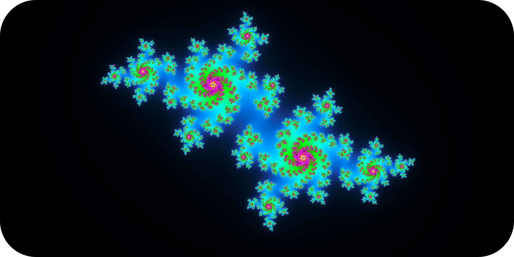
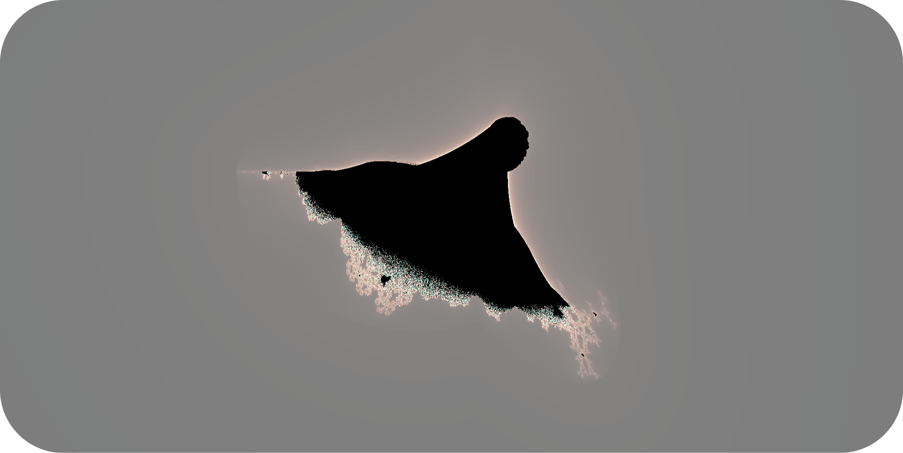
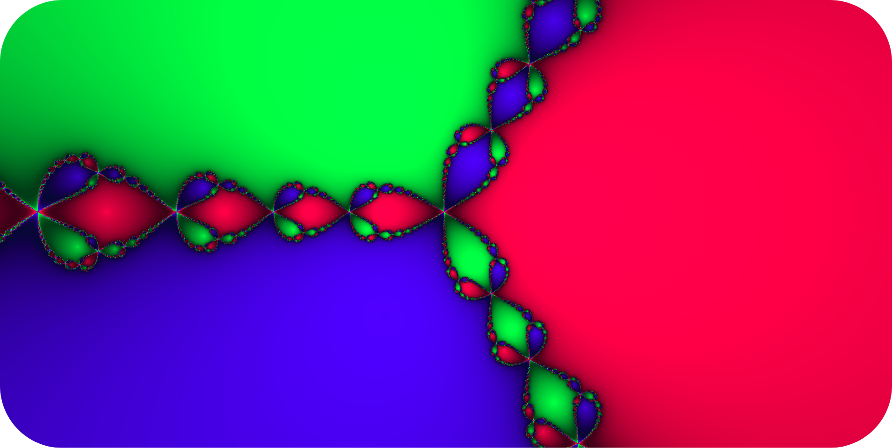
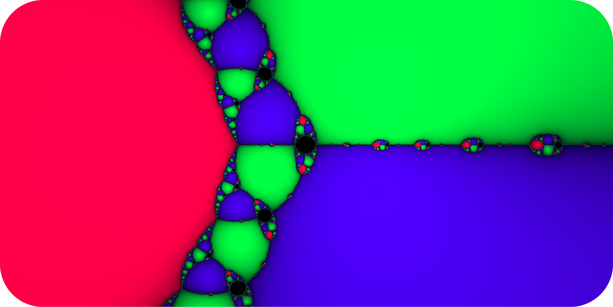

# Fractals


This is a simple C / C++ application that allows you to generate and explore colored fractals.
These fractals are generated in real time thanks to the GPU power.
It is possible to zoom in and out and move in the complex plane with your mouse.

Deep zooms are made possible by emulating doubles on the GPU, so the precision of
calculations is increased, which allows to zoom deeper into the fractal.

## Summary

* **[Fractals](#fractals)**
* **[Build](#build)**
* **[Libraries](#libraries)**
* **[License](#license)**
* **[Releases](#releases)**
* **[Credits](#credits)**

## Images

### Mandelbrot



### Julia




### Burning Ship



### Newton




## Build

To build this project, you need to have CMake of Make installed depending on your system. Make the way to go if you are on Linux or MacOS, if you are on Windows, I recommend using CMake.

### Linux / MacOS

Run the follwing commands in your terminal

```bash
$ git clone https://github.com/leoraclet/fractals
$ cd fractals/
$ make .
$ ./fractals
```

### Windows

I can't guarantee that it will build the project properly on windows since I only tested it on Linux by now, so you're on your own this time.

## Libraries

* [**Dear ImGui**](https://github.com/ocornut/imgui) ~ Bloat-free Graphical User interface for C++ with minimal dependencies
* [**SFML**](https://github.com/SFML/sfml) ~ Simple and Fast Multimedia Library
* [**GLAD**](https://glad.dav1d.de/) ~ OpenGl loader
* [**stb**](https://github.com/nothings/stb) ~ STB single-file public domain libraries for C/C++
* [**glm**](https://github.com/g-truc/glm) ~ OpenGL Mathematics

## License

This project is released under the [**MIT**](https://github.com/leoraclet/fractals/LICENSE) license.

## Releases

To run the program without editing the source code or building
it yourself, go see the [**Releases**](https://github.com/leoraclet/fractals/releases).

## Credits

* [**Léo Raclet**](https://github.com/leoraclet) : Creator of the project.
