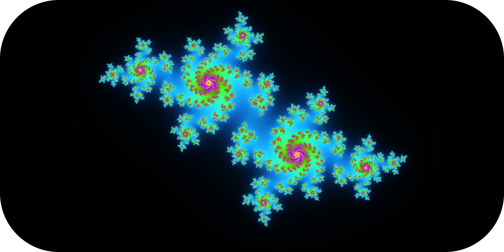
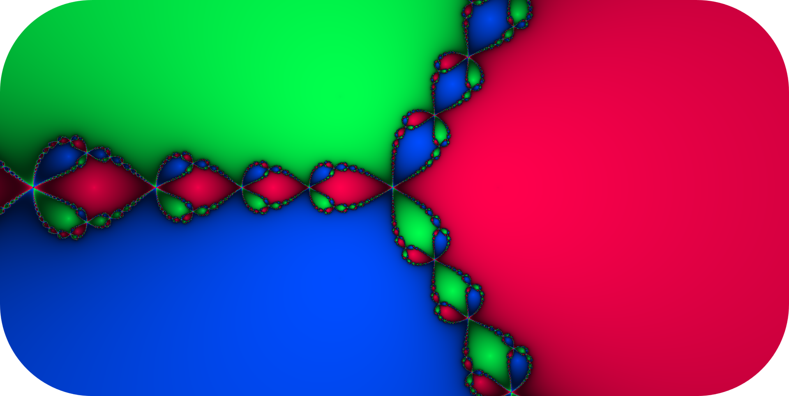
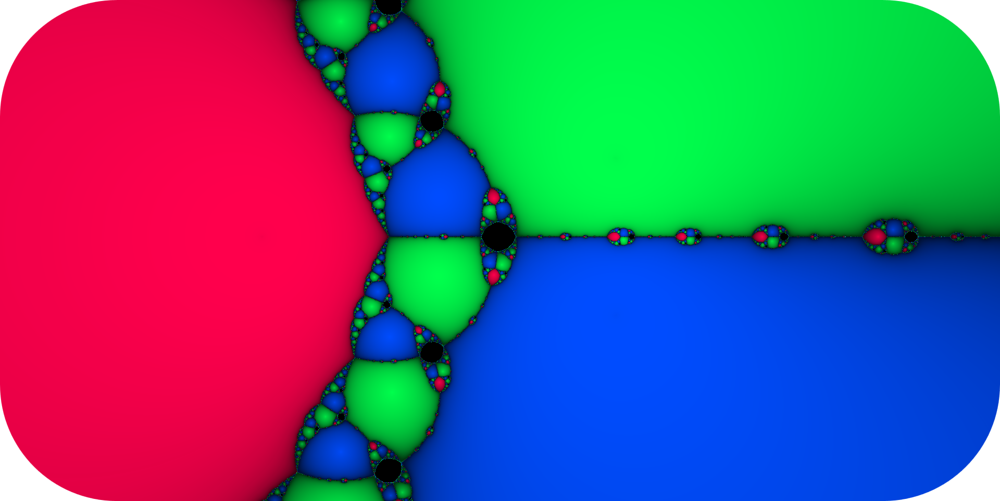

<div align="center"></div>
<h1 align="center">Fractals Explorer</h1>

<div align="center">


</div>

## Table of Contents
- [Table of Contents](#table-of-contents)
- [📖 About](#-about)
- [🌟 Showcase](#-showcase)
  - [Mandelbrot](#mandelbrot)
  - [Julia](#julia)
  - [Burning Ship](#burning-ship)
  - [Newton](#newton)
- [✨ Features](#-features)
- [📦 Structure](#-structure)
- [📚 Libraries](#-libraries)
- [🔧 Build](#-build)
  - [Nix (recommended for MacOS and Linux)](#nix-recommended-for-macos-and-linux)
  - [Windows (WSL)](#windows-wsl)
- [🚀 Releases](#-releases)
- [📜 License](#-license)


## 📖 About

This lightweight C/C++ application lets you generate and explore colorful fractals in real time,
leveraging the power of the GPU. You can zoom in and out and navigate the complex plane using your
mouse.

To enable deep zoom capabilities, the program simulates double-precision calculations on the GPU.
This boosts the accuracy of computations, allowing for much deeper zoom levels.

## 🌟 Showcase

### Mandelbrot


### Julia

 <br>
<br>


### Burning Ship


### Newton

 <br>
<br>



## ✨ Features

- **Project**

  - 🔄 **Reproducible**: Built with Nix, this configuration can be effortlessly reproduced on other
    machines, ensuring a consistent setup.

  - 📖 **Documented**: Most of the parts of my configuration files are commented and documented with
    links and explanations if necessary

- **Application**

  - 🌀 **Real-time fractal generation**: Utilizes GPU acceleration to render fractals instantly.

  - 🎨 **Colorful visualizations**: Generates vivid, dynamic color schemes for fractals.

  - 🖱️ **Interactive exploration**: Navigate the complex plane with your mouse — zoom in, zoom out,
    and pan smoothly.

  - 🔍 **Deep zoom support**: Emulates double-precision floating point on the GPU to allow
    ultra-deep zoom levels without significant loss of precision.

  - ⚙️ **Written in C/C++**: Lightweight and efficient native application using C/C++ for high
    performance.

  - 🧮 **High precision computation**: Enhanced numerical precision enables detailed and accurate
    fractal rendering even at extreme zoom levels.


## 📦 Structure

- **Directories**

  - [**`src`**](./src/) - Source files (`.cpp`)
  - [**`libs`**](./libs/) - External libraries
  - [**`assets`**](./assets/) - Images and Shaders
  - [**`build`**](./docs/) - CMake build files

- **Files**

  - `flake.nix` - Environment configuration (based on
    [**dev-templates**](https://github.com/the-nix-way/dev-templates))
  - `.envrc` - Used by **direnv** to load **Flakes**
  - `flake.lock` - Used by **Flakes** to version packages

## 📚 Libraries

- [**Dear ImGui**](https://github.com/ocornut/imgui) ~ Bloat-free Graphical User interface for C++
  with minimal dependencies
- [**SFML**](https://github.com/SFML/sfml) ~ Simple and Fast Multimedia Library
- [**GLAD**](https://glad.dav1d.de/) ~ OpenGl loader

> [!NOTE]
>
> Looking at the source code of [SFML](https://github.com/SFML/SFML), it appears that **stb** and
> **GLAD** are already included (but I keep them here anyway).

## 🔧 Build

### Nix (recommended for MacOS and Linux)

> [!NOTE]
>
> I'm using NixOS as my day-to-day OS, and I have found that **Nix** with **Flakes** was the
> simplest and fastest way for me to setup C/C++ project with external libraries.

To build this project, first make sure you have [Nix](https://nixos.org/download/) installed as a
package manager and [direnv](https://direnv.net/) as a shell extension.

Then, configure it to enable [Flakes](https://nixos.wiki/wiki/flakes) according to your setup.

Once you're ready, you can start by cloning this repo

```bash
git clone https://github.com/leoraclet/fractals
cd fractals
```

> [!TIP]
>
> Now, **direnv** should load the environment when inside the project directory, if not, try
> ```bash
> direnv allow
> ```

The `flake.nix` file is where the project's environment is defined, and you can see in it that
[CMake](https://cmake.org/) is part of the packages. So, if everything went well, you should be able
to build the project like so

```bash
cmake -B build -S .
cd build
cmake --build .
```

Then, you can run the produced executable in `build` with

```basb
./fractals
```

### Windows (WSL)

> [!WARNING]
>
> I have **NOT** tested the building process on Windows, so you're basically on your own for this.

The best solution to build this project on Windows is to use
[WSL](https://learn.microsoft.com/en-us/windows/wsl/install) and follow the
[Nix](#nix-recommended-for-macos-and-linux) way in it.

You can start by installing nix [here](https://nixos.org/download/#nix-install-windows).

## 🚀 Releases

To run the program without editing the source code or building it yourself, go see the
[**Releases**](https://github.com/leoraclet/fractals/releases).
## 📜 License

This project is licensed under the MIT License - see the [LICENSE](LICENSE) file for details.